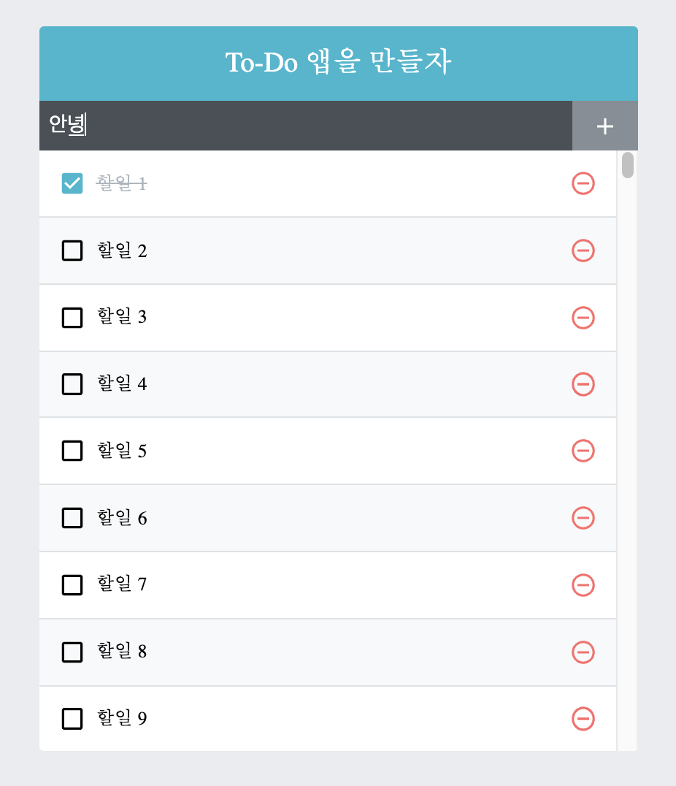

# 완성본

## 구성요소

1. `TodoTemplate`: 화면 가운데 정렬, 앱 타이틀을 보여줍니다. children으로 내부 JSX를 props로 받아와 렌더링 해줍니다.
2. `TodoInsert`: 새로운 항목을 입력하고 추가할수 있는 컨포넌트, state를 이용해 인풋 상태관리
3. `TodoListenItem`: 각 할 일 항목에 대한 정보를 보여줍니다. todo 객체를 props로 받아와서 상태에 따라 다른 UI 보여줍니다.
4. `TodoList`: todos 배열을 props로 받은 후 TodoListenItem 컴포넌트로 변환해 보여줍니다.

